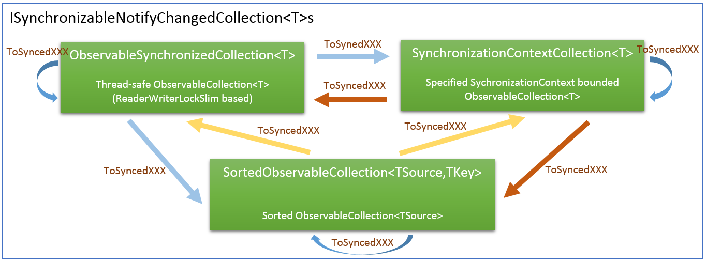
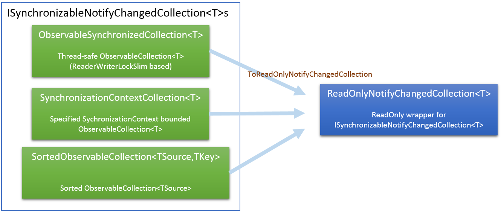
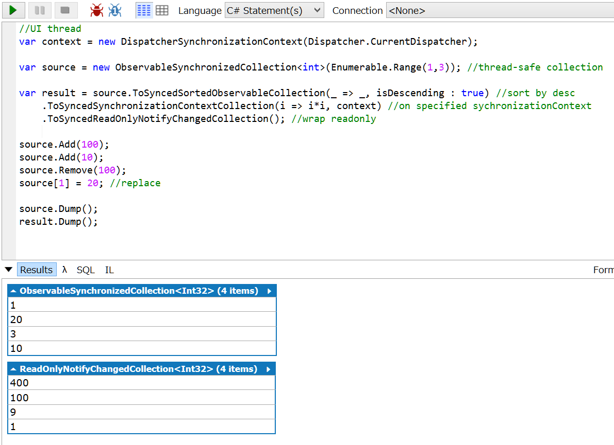
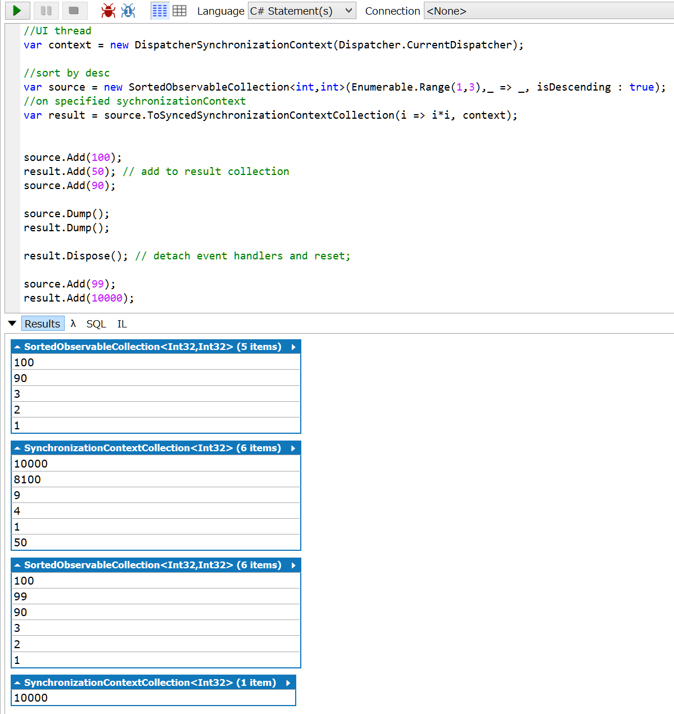

* .NETStandard 2.0 version by Jose Fajardo

# StatefulModel
these classes are frequent use of stateful Models for M-V-Whatever.
PCL(Portable Class Library) & MIT License.

supported
- .NET Framework 4.5
- Windows 8
- Windows Phone Silverlight 8
- Xamarin.Android
- Xamarin.iOS
- Xamarin.iOS(Classic)

## License
MIT License. 

## NotifyCollections

the classes that implement ISynchronizableNotifyChangedCollection < T > have ToSyncedXXX Methods (XXX ... any ISynchronizableNotifyChangedCollection < T >).

ToSyncedXXX Methods is creating one-way synchronized collection with source collection. 




###Simple Usage
```csharp

	//thread-safe collection
	var source = new ObservableSynchronizedCollection<int>(Enumerable.Range(1,3));
	// sorted collection
	var sortedSource = new SortedObservableCollection<int,int>(Enumerable.Range(1,4),i => i);
	//UI thread
	var context = new DispatcherSynchronizationContext(Dispatcher.CurrentDispatcher);
	//SynchronizationContext(send) bouded collection.
	var dispatcherSource = new SynchronizationContextCollection<int>(Enumerable.Range(1,5),context);

```

### Sync Collections
While creating one-way synchronized collection, this method lock source collection, so no leak items.

### Detach
ISynchronizableNotifyChangedCollection < T > is IDisposable. When Dispose() called , all EventHandler from source collection will be detached.


## EventListeners

PropertyChangedEventListener/CollectionChangedEventListener
```csharp
	//use collection initializer
	var listener = new PropertyChangedEventListener(NotifyObject)
	{
		{"Property1", (sender,e) => Hoge()},
		{"Property2", (semder,e) => Huge()}
	};
	
	listener.RegisterHandler((sender,e) => Hage());
	listerer.RegisterHandler("Property3",(semder,e) => Fuga());
	
	//when dispose() called, detach all handler
	listerner.Dispose();
```
### WeakEventListeners

- PropertyChangedWeakEventListener (PropertyChangedEventListener by weak event)
- CollectionChangedWeakEventListener (CollectionChangedWeakEventListener by weak event)
- WeakEventListener (all‐purpose weak event listener)

```csharp

	var button = new Button(){Width = 100,Height = 100};

	var weakListener = new WeakEventListener<RoutedEventHandler,RoutedEventArgs>(
		h => new RoutedEventHandler(h),
		h => button.Click += h,
		h => button.Click -= h,
		(sender,e) => button.Content = "Clicked!!");

```
### Anonymouses

- AnonymousComparer < T >
- AnonymousDisposable
- AnonymousSynchronizationContext
etc

## Other Classes

- CompositeDiposable -  Rx like CompositeDisposable
etc


 

	
